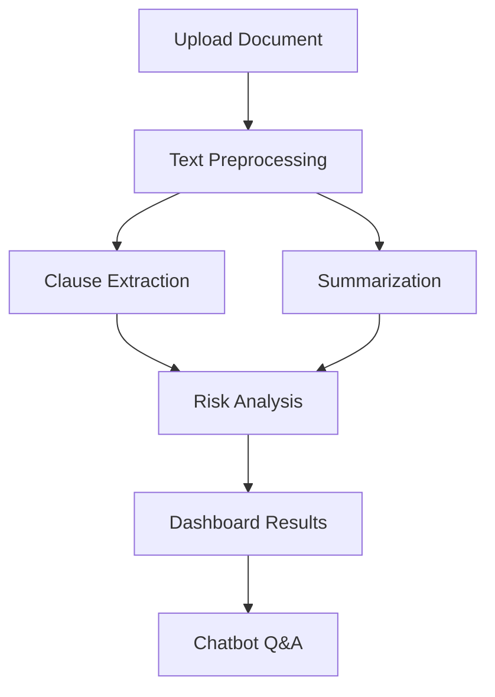
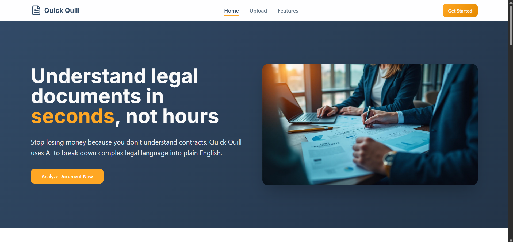
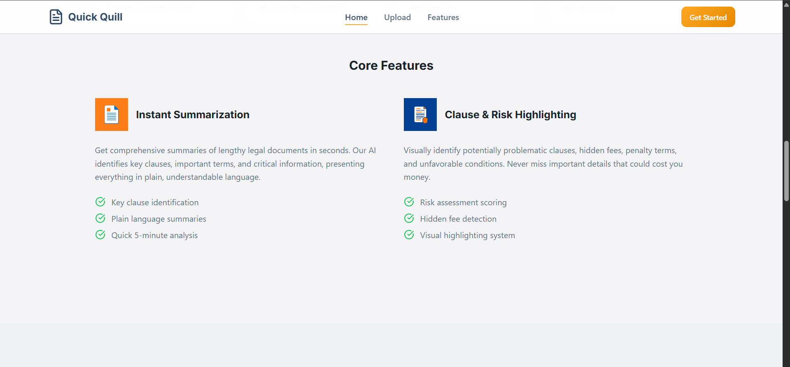

# 🖋️ Quick Quill – AI Contract Analyzer  

> ⚡ An AI-powered legal assistant that **summarizes, analyzes risks, and enables chatbot interactions** with contracts.  
> Built for the **Gen AI Exchange Hackathon 2025**.  

---

## 🌟 Why Quick Quill?  
Contracts are long, complex, and full of hidden risks.  
**Quick Quill** makes legal documents **understandable in minutes** by:  
- 📑 Extracting and analyzing **clauses**  
- ⚖️ Highlighting **risks** (Low / Medium / High)  
- ✍️ Generating **concise summaries**  
- 🤖 Providing a **chatbot** to query contracts in plain English  

---

## 🚀 Features  
- 📑 **Clause Analysis** – Identify and highlight important clauses  
- ⚖️ **Risk Detection** – Assess potential risks with reasoning  
- ✍️ **Summarization** – AI-generated summaries of lengthy documents  
- 🤖 **AI Chatbot** – Ask anything about the contract and get instant answers  
- 🔍 **Explainability** – Each risk tagged with context & rationale  

---

## 🛠️ Tech Stack  
- **Frontend**: React.js  
- **Backend**: Flask (API)  
- **ML/NLP Pipeline**:  
  - Preprocessing (tokenization, cleaning)  
  - Clause Extraction (NLP-based)  
  - Summarization (Transformer models)  
  - Risk Classification (LLM-powered reasoning)  
  - Chatbot (Retrieval-Augmented QA)  
- **Database**: SQLite  
- **Deployment (Future)**: Hugging Face Spaces / Render + Vercel  

---

## 📊 Machine Learning Pipeline  


## ⚡ How It Works  
1. Upload a **contract (PDF/TXT)**  
2. AI extracts clauses & runs **summarization + risk analysis**  
3. Dashboard displays:  
   - 📑 Summary  
   - ⚖️ Risks (Low/Medium/High)  
   - 🗂️ Highlighted Clauses  
4. Chatbot answers user queries about the document  

---

## 🎯 Impact  
- ⏱️ Saves **hours of manual reading**  
- ⚖️ Helps users **spot hidden risks quickly**  
- 🤝 Makes contracts **accessible to non-lawyers**  
- 🌍 Can be extended for **legal tech startups & enterprises**  

---

## 📸 Screenshots  

### 🖥️ Dashboard  
  

### 📂 Document Upload & Analysis  
  

### ⚖️ Features Overview  
  

### 🤖 Chatbot Feature  
  

---

## 📌 Future Scope  
- Multi-document comparison  
- Integration with e-signature tools  
- Fine-tuned models for legal domain  
- Visual risk heatmaps  

---

## 👩‍💻 Team / Contribution  
Developed by **[Your Name]** for **Gen AI Exchange Hackathon 2025** 🚀  

---

## ⚙️ How to Run  

### 1️⃣ Frontend (React)  
```
# Install dependencies
npm install

# Install react-markdown
npm install react-markdown

# Start development server
npm run dev

```

### 2️⃣ Backend (Flask)

```
cd backend

# Install Python dependencies
pip install -r requirements.txt

# Run backend
python app.py

```

### Your app will be live on:

## Frontend → http://localhost:5173 (default for Vite/React)

## Backend API → http://localhost:5000
